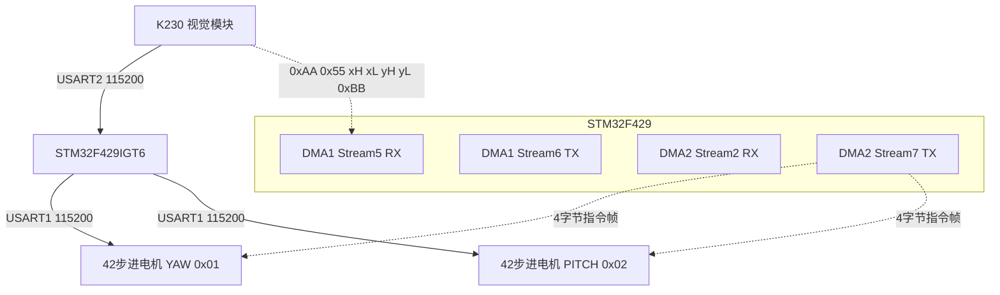

# 二维云台视觉追踪 — 项目总览

## 比赛背景

- **项目**: 二维云台 360度 实时视觉追踪系统
- **主控芯片**: STM32F429IGT6
- **主频**: 180MHz（HSI 16MHz → PLL: M=8, N=180, P=2）
- **开发环境**: Keil MDK-ARM + CubeMX, HAL 库 + C++混合编译
- **电机驱动库**: 张大头 X_V2 闭环步进伺服驱动

## 核心功能

| 功能 | 实现方式 | 说明 |
|------|----------|------|
| 目标识别 | K230 视觉模块 | 识别目标物，输出像素坐标 (x, y) |
| 数据接收 | USART2 DMA + 空闲中断 | 30字节环形DMA缓冲，IDLE中断帧检测 |
| 坐标解算 | P控制器 | 像素偏差→速度映射，10px死区 |
| 双轴追踪 | X_V2 闭环步进电机×2 | YAW(航向) + PITCH(俯仰)，速度模式 |
| 电机通信 | USART1 DMA TX | 4字节指令帧，DMA异步发送 |

## 硬件架构



## 引脚分配

| 引脚 | 功能 | 说明 |
|------|------|------|
| PA9 | USART1_TX | 电机驱动指令发送 (DMA2_S7) |
| PA10 | USART1_RX | 电机驱动应答接收 (DMA2_S2) |
| PA2 | USART2_TX | K230 通信 (DMA1_S6) |
| PA3 | USART2_RX | K230 坐标接收 (DMA1_S5) |

## K230 通信协议

```
帧格式: 0xAA 0x55 [target_x H] [target_x L] [target_y H] [target_y L] 0xBB
         帧头                 X坐标(16bit)           Y坐标(16bit)      帧尾
总长: 7字节
```

- 图像中心: (320, 240)
- 目标坐标: 相对图像左上角的像素位置

## 电机指令帧

```
格式: [Addr] [Func] [Aux] [Checksum]
       地址    功能码  辅助码  校验=0x6B(固定)
总长: 4字节
```

| 电机 | ID | 功能 |
|------|-----|------|
| YAW (航向) | 0x01 | 水平360度旋转 |
| PITCH (俯仰) | 0x02 | 垂直俯仰 |

## 控制参数

| 参数 | YAW | PITCH |
|------|-----|-------|
| KP | 0.15 | 0.15 |
| 死区 | 10px | 10px |
| 最大速度 | 300 | 200 |
| 加速度 | 400 | 400 |
| 控制间隔 | >= 30ms | >= 30ms |

## 关键驱动文件

| 文件 | 说明 |
|------|------|
| `Core/Src/X_V2.cpp` | 电机驱动库 + K230解析 + 云台控制 (~3000行) |
| `Core/Src/X_V2.h` | 电机API声明、电机ID/参数枚举 |
| `Core/Src/main.c` | 主循环、初始化、追踪调度 |
| `Core/Src/usart.c` | USART1/2 + DMA配置 |
| `Core/Src/dma.c` | DMA1/2 初始化 |
| `Core/Src/stm32f4xx_it.c` | USART1/2 IDLE中断处理 |

## 相关笔记

- [[二维云台-硬件架构与通信链路]]
- [[二维云台-踩坑日记]]

## 源代码下载

[:material-download: 下载源代码 (ZIP)](源代码/二维云台_源代码.zip)

> 解压后用 STM32CubeMX 打开 .ioc 文件可自动生成 Middlewares 和 Drivers。