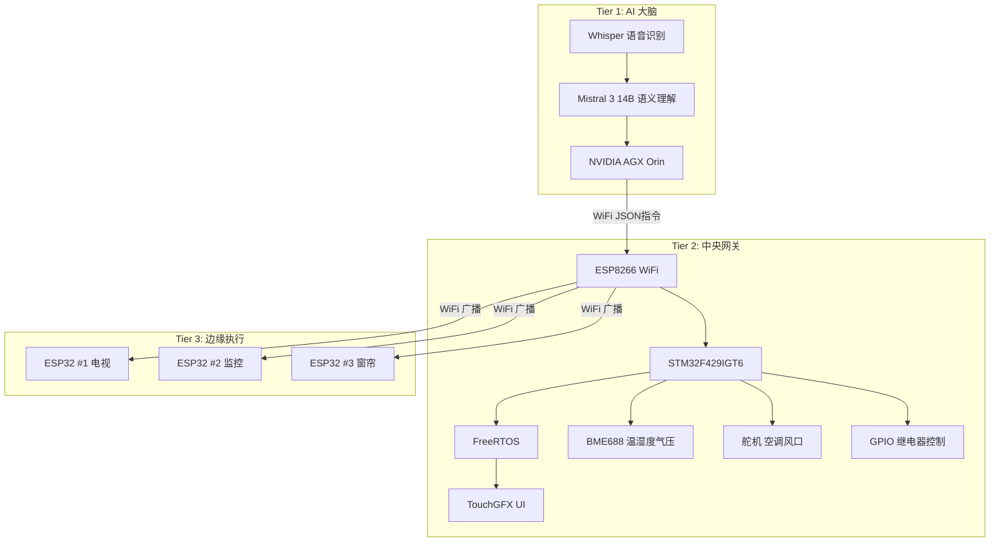

# 智能家居系统 — 项目总览

## 项目背景

- **项目**: 三层架构智能家居系统（AGX Orin + STM32F429 + ESP32）
- **主控芯片**: STM32F429IGT6（阿波罗 F429 开发板）
- **主频**: 180MHz（HSE 25MHz → PLL: M=25, N=360, P=2）
- **RTOS**: FreeRTOS (CMSIS-OS v2)
- **UI 框架**: TouchGFX
- **WiFi 模块**: ESP8266 (ATK_MW8266D, AT 指令集)

## 三层架构



## 核心功能

| 层级 | 功能 | 实现 |
|------|------|------|
| AGX Orin | 语音→文字 | Whisper 本地推理 |
| AGX Orin | 语义→指令 | Mistral 3 14B, JSON 下发 |
| STM32F429 | 环境采集 | BME688 (ESP32采集, UART上报) |
| STM32F429 | WiFi 通信 | ESP8266 AT 指令, TCP Server:8080 |
| STM32F429 | 触控交互 | TouchGFX: 传感器+设备控制 |
| STM32F429 | 设备控制 | 舵机(PWM) + GPIO 继电器 |
| ESP32 ×3 | 边缘执行 | 接收WiFi广播, 控制家电 |

## 引脚分配

| 引脚 | 功能 | 说明 |
|------|------|------|
| PB10 | USART3_TX | ESP8266 通信 |
| PB11 | USART3_RX | ESP8266 通信 |
| PA0 | TIM2_CH3 | 舵机 PWM (空调风口) |
| PA1 | TIM1_CH2 | 风扇 PWM |
| PA4 | GPIO OUT | 空调继电器 (仅转发AGX指令) |
| PA5 | GPIO OUT | 制冷/制热切换 |
| PB0 | GPIO OUT | 电视控制 |
| PB1 | GPIO OUT | 监控控制 |

## FreeRTOS 任务

| 任务 | 优先级 | 栈 | 说明 |
|------|--------|-----|------|
| TouchGFX_Task | Normal | 2048 | UI刷新 + AI指令解析 + 传感器显示 |
| StartWifiSendTask | Normal | 512 | 非阻塞WiFi发送（队列驱动） |
| IDLE | 最低 | - | 空闲任务 |

**消息队列**:
| 队列 | 容量 | 用途 |
|------|------|------|
| aiCommandQueueHandle | 5×uint32_t | AGX Orin JSON指令 → UI任务 |
| wifiCommandQueueHandle | 16×uint32_t | UI按钮 → WiFi发送任务 |

## 通信协议

### AGX Orin → STM32 (WiFi JSON)
```
{"action":"open", "device":"空调", "mode":"制热"}
```

### ESP32 传感器数据 (UART)
```
BME688:T=25.3,H=65.2,P=1013.2,IAQ=50
```

### STM32 → ESP32 (WiFi 广播)
```
OPENTV_ON\n     → ESP32 #1 开电视
OPENJK_ON\n     → ESP32 #2 开监控
OPENT_ON\n      → ESP32 #3 开窗帘
```

### ESP8266 AT 初始化序列
```
AT → OK
AT+CWMODE=1 → OK
AT+CWJAP="zhinengjiaju","12345678" → OK
AT+CIPMUX=1 → OK
AT+CIPSERVER=1,8080 → OK
```

## 关键文件

| 文件 | 说明 |
|------|------|
| `Core/Src/main.c` | 系统初始化、ESP8266 AT 序列、UART3 中断解析 |
| `Core/Src/freertos.c` | 任务创建、消息队列 |
| `Core/Src/tim.c` | TIM1 PWM(风扇) + TIM2 PWM(舵机) |
| `Core/Src/usart.c` | USART3 配置 (ESP8266) |
| `TouchGFX/gui/src/screen2_screen/Screen2View.cpp` | UI 交互、AI 指令匹配、设备控制 |
| `BSP/ATK_MW8266D/` | ESP8266 驱动库 |

## 相关笔记

- [[智能家居-三层架构与通信链路]]
- [[智能家居-踩坑日记]]

## 源代码下载

[:material-download: 下载源代码 (ZIP)](源代码/智能家居_源代码.zip)

> 解压后用 STM32CubeMX 打开 .ioc 文件可自动生成 Middlewares 和 Drivers。