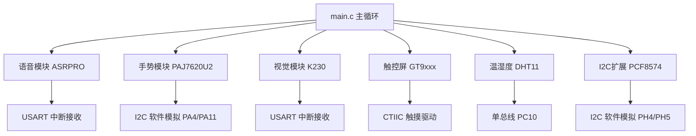

# 智能导航仪 — 项目总览

## 比赛背景

- **赛题**: 智能导航仪 — 多模态交互嵌入式系统设计
- **主控芯片**: STM32F429IGT6（阿波罗 F429 开发板）
- **主频**: 180MHz（HSE + PLL）
- **开发环境**: Keil MDK-ARM，HAL 库

## 外设总览

| 模块 | 型号 | 通信方式 | 功能 |
|------|------|----------|------|
| 语音识别 | ASRPRO | UART（串口） | 语音指令识别与响应 |
| 手势识别 | PAJ7620U2 | I2C（软件模拟） | 9种手势动作识别 |
| 视觉采集 | K230 | UART（串口） | 图像/物体识别 |
| 触控屏 | GT9xxx/FT5206 | I2C（CTIIC驱动） | 触控操作与UI交互 |
| 温湿度 | DHT11 | 单总线（自定义） | 环境温湿度采集 |
| I2C扩展 | PCF8574 | I2C（软件模拟） | GPIO扩展 |

## 引脚分配表

| 引脚 | 功能 | 所属模块 |
|------|------|----------|
| PH4 | I2C1 SCL | PCF8574 / 通用I2C |
| PH5 | I2C1 SDA | PCF8574 / 通用I2C |
| PA4 | I2C2 SCL | PAJ7620U2 专用I2C |
| PA11 | I2C2 SDA | PAJ7620U2 专用I2C |
| PC10 | DHT11 DATA | DHT11 单总线 |
| PA9/PA10 | USART1 TX/RX | 调试/通信 |
| PA2/PA3 | USART2 TX/RX | 模块通信 |
| PC6/PC7 | USART6 TX/RX | 模块通信 |
| PC12/PD2 | UART5 TX/RX | 模块通信（DMA发送） |
| PE5 | GPIO OUT | 输出控制（USART6触发） |
| PE6 | GPIO OUT | 输出控制（USART6触发） |
| PB15 | GPIO OUT | 手势响应输出 |

## 软件架构

## 关键驱动文件

| 文件 | 说明 |
|------|------|
| `BSP/IIC/myiic.c` | 通用软件I2C驱动（PH4/PH5） |
| `PAJ7620U2/paj7620u2_iic.c` | PAJ7620U2专用I2C驱动（PA4/PA11） |
| `PAJ7620U2/paj7620u2.c` | 手势识别传感器驱动 |
| `BSP/DHT11/DHT11.C` | DHT11温湿度驱动 |
| `BSP/delay/delay.c` | SysTick延时（主系统） |
| `BSP/DHT11/delay.c` | TIM6硬件延时（DHT11专用） |
| `PCF8574/pcf8574.c` | I2C GPIO扩展芯片驱动 |
| `Core/Src/usart.c` | 串口配置（USART1/2/5/6） |

## 相关笔记

- [[硬件架构文档]]
- [[踩坑日记]]
- [[模块通信链路]]

## 源代码下载

[:material-download: 下载源代码 (ZIP)](源代码/智能导航仪_源代码.zip)

> 解压后用 STM32CubeMX 打开 .ioc 文件可自动生成 Middlewares 和 Drivers。