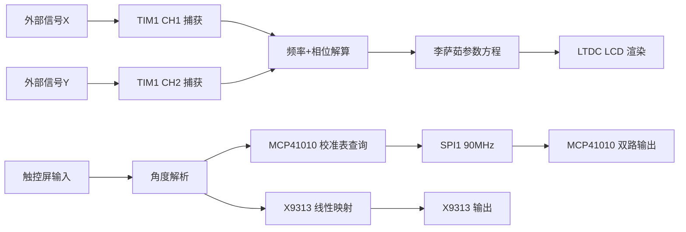

# 李萨茹 — 硬件架构与通信链路

## 信号采集链路

### TIM1 双路输入捕获

TIM1 是高级定时器，挂载在 APB2(180MHz)，**0 预分频**，计数器直接以 180MHz 运行。

```
外部信号X --> PA8 --> TIM1_CH1 --> 下降沿捕获 --> capture_x
外部信号Y --> PA9 --> TIM1_CH2 --> 下降沿捕获 --> capture_y
```

**频率计算**:
```c
// 周期法测频
Period_ticks = current_x - last_valid_x;  // 相邻下降沿间隔
freq_x = 180000000.0f / Period_ticks;     // 180MHz / ticks = 频率(Hz)
```

**相位计算**:
```c
// 核心：16位自然溢出 + 取模运算
int16_t diff = (int16_t)(y_time - x_time);
int32_t delta_ticks = (int32_t)diff % (int32_t)p_ticks;
if (delta_ticks < 0) delta_ticks += p_ticks;

phase_rad = (delta_ticks / p_ticks) * 2PI;  // 相位差 -> 弧度
```

> 16位自然溢出：`(int16_t)(y - x)` 在差值 > 32767 时自动变为负数，配合取模运算，巧妙解决了大角度（>180度）时的跳变问题。

### 噪声抑制

```c
// 输入滤波：ICFilter = 15（最大数字滤波）
// 软件滤波：只接受周期 >= 800 ticks（freq <= 225kHz）的有效值
if (temp_period_x >= 800) {
    Period_ticks = temp_period_x;  // 更新有效值
}
```

## 数字移相网络

### 架构总览

```
                    +--------------+
                    |  STM32F429   |
                    |   SPI1       |
                    |   (90MHz)    |
                    +--+---+---+---+
          PA4(CS1) ---+   |   +--- PA3(CS2)
        PA7(MOSI) --------+----------+
        PB3(SCK) ---------+
                    +------+------+
                    |  MCP41010   |
                    |  U1 + U2    |
                    |  双路256阶  |
                    +-------------+

              PA5(CS) --- X9313 --- 32阶 EEPROM
              PB1(UD) --- 方向控制
              PB0(INC) -- 脉冲输入
```

### MCP41010 (SPI 接口)

| 属性  | 值                                |
| --- | -------------------------------- |
| 接口  | 硬件 SPI1                          |
| 速度  | SPI_BAUDRATEPRESCALER_2 -> 90MHz |
| 分辨率 | 256 阶 (8-bit)                    |
| 通道数 | 2 (U1 + U2 独立片选)                 |
| 片选1 | PA4 (CS1)                        |
| 片选2 | PA3 (CS2)                        |
| 指令  | 0x11 = 写通道0                      |

> **注意**: 虽然是数字电位器，但 MCP41010 用的是 **SPI** 接口。

### 手测校准表

核心创新：通过**手工逐点测量**建立 60 组角度->阶数的映射表：

```
角度表:  5   6   7   10  15  ...  170  175  180
U1阶数:  0  11  20   70 100  ...  249  250  251
U2阶数:  0  11  20   70 100  ...  250  250  250
```

- U1 和 U2 **独立校准**（180度附近 U1=251, U2=250）
- 支持**线性插值**：非测量点自动内插
- 含**硬件并联补偿**：消除 2.7k-ohm 并联电阻的非线性影响

### X9313 (3线接口)

| 属性 | 值 |
|------|-----|
| 接口 | 3线 (CS + U/D + INC) |
| 分辨率 | 32 阶 (5-bit) |
| 存储 | 内置 EEPROM |
| 映射 | 0~180 线性映射到 0~31 阶 |
| 优化 | 仅变化时写入，减少脉冲次数 |

## 显示子系统

| 组件 | 说明 |
|------|------|
| 显示接口 | LTDC (RGB888) |
| 显存 | 外部 SDRAM (32MB) |
| 分辨率 | 800x480 |
| 触控 | FT5206/GT9xxx (I2C) |
| 绘图加速 | DMA2D (Chrom-Art) |

## 李萨茹图形渲染管线

```
TIM1捕获 -> 频率/相位测量 -> TIM3(2Hz)触发 -> 参数方程解算 -> SDRAM绘制
```

```c
// 参数方程
x = 190 * sin(t)              // X轴振幅 190px
y = 190 * sin(t * freq_ratio + phase_rad)  // Y轴含频率比 + 相位

// 240点连成闭合曲线
for i in 0..239:
    screen_x[i] = 220 + (int16_t)x_val
    screen_y[i] = 220 - (int16_t)y_val  // LCD坐标系Y轴反转

// 逐段连线
lcd_draw_line(screen_x[i], screen_y[i], screen_x[i+1], screen_y[i+1], GREEN)
```

## 数据流总览


