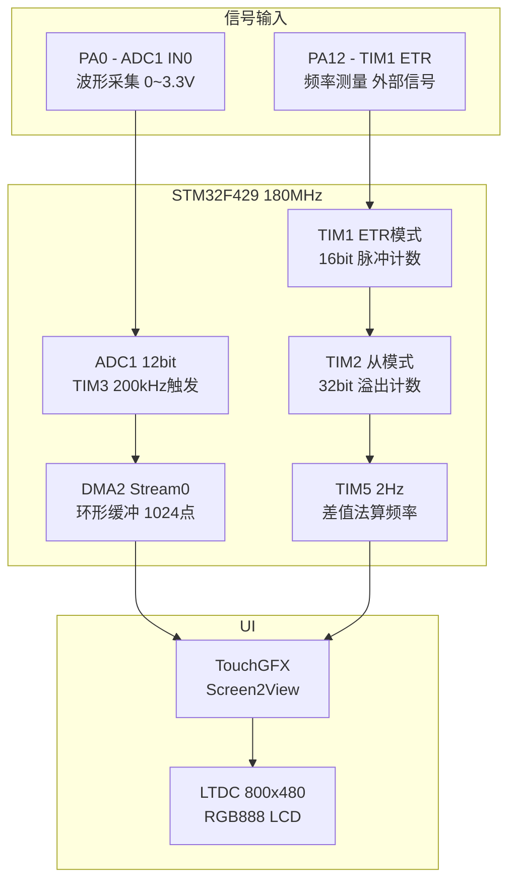

# 示波器 — 项目总览

## 项目背景

- **项目**: 便携式数字示波器
- **主控芯片**: STM32F429IGT6（阿波罗 F429 开发板）
- **主频**: 180MHz（HSE 25MHz → PLL: M=15, N=216, P=2）
- **RTOS**: FreeRTOS (CMSIS-OS v2)
- **UI 框架**: TouchGFX
- **开发环境**: Keil MDK-ARM + CubeMX + TouchGFX Designer

## 核心功能

| 功能 | 实现方式 | 说明 |
|------|----------|------|
| 波形采集 | ADC1 + DMA2_Stream0 循环模式 | PA0 输入，12bit，200ksps，1024点环形缓冲 |
| 采样触发 | TIM3 (200kHz TRGO) | 90分频 → 2MHz / 10 = 200kHz 精确触发 |
| 高频测频 | TIM1 ETR + TIM2 级联 (48bit) | PA12 外部信号 → ETR计数 → 级联 16+32=48bit |
| 周期测频 | TIM5 (2Hz) 差值法 | 每500ms 读取级联计数器差值 = 频率Hz |
| 波形显示 | TouchGFX dynamicGraph | 3点滑动平均 + 200点/帧 |
| 电压测量 | 峰值保持(Peak-Hold) | 1024点扫最大值 + 缓慢衰减(10mV/tick) |
| 频率显示 | 智能单位切换 | <1kHz→Hz, <1MHz→kHz, >=1MHz→MHz |

## 硬件架构



## 定时器分配

| 定时器 | 功能 | 配置 | 关键参数 |
|--------|------|------|----------|
| TIM1 | ETR 外部脉冲计数 | ETRMODE2, PA12, /1 | 16bit, 溢出→TRGO→TIM2 |
| TIM2 | 级联溢出计数 | Slave EXTERNAL1, ITR0 | 32bit, 48bit 总计数 |
| TIM3 | ADC 采样触发 | 90分频→2MHz, 周期=10 | TRGO 200kHz → ADC |
| TIM5 | 周期测频 | 9000分频→20kHz, 周期=10000 | 2Hz, 差值法算频率 |

## ETR 级联测频原理

```
外部信号 → PA12 → TIM1_ETR → TIM1计数器(+1/脉冲)
    ↓ (TIM1溢出)
TIM1_TRGO → ITR0 → TIM2从模式(+1/溢出)
    ↓ (TIM5 每500ms)
48bit 绝对计数: high_16(TIM2) << 16 | low_16(TIM1)
    ↓
频率 = (当前计数 - 上次计数) / 0.5s = delta_pulses Hz
```

> 48bit 计数器最大可计 2.8×10^14 个脉冲，足够长时间高精度测量。

## 关键驱动文件

| 文件 | 说明 |
|------|------|
| `Core/Src/adc.c` | ADC1 + DMA2_S0 循环模式，TIM3触发 |
| `Core/Src/tim.c` | TIM1 ETR + TIM2 级联 + TIM3 + TIM5 |
| `Core/Src/main.c` | 系统初始化、TIM5 频率回调 |
| `Core/Src/freertos.c` | TouchGFX 任务创建 |
| `TouchGFX/gui/src/screen2_screen/Screen2View.cpp` | 波形绘制、峰值保持、频率格式化 |
| `TouchGFX/gui/src/model/Model.cpp` | TouchGFX Model (tick) |

## 相关笔记

- [[示波器-硬件架构与通信链路]]
- [[示波器-踩坑日记]]

## 源代码下载

[:material-download: 下载源代码 (ZIP)](源代码/示波器_源代码.zip)

> 解压后用 STM32CubeMX 打开 .ioc 文件可自动生成 Middlewares 和 Drivers。